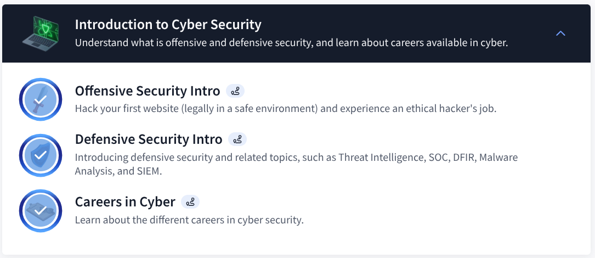

# TryHackMe: Introduction to Cyber Security  
**Completed: October 31, 2025**

### Key Takeaways
1. **Cybersecurity protects Confidentiality, Integrity, and Availability (CIA triad).**
2. **Offensive security finds flaws; defensive security stops attacks.**
3. **I deployed my first VM — no prior tech skills needed.**

> **Next**: Network Fundamentals → Security+ in 90 days
